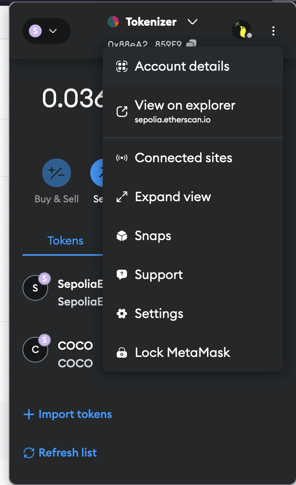
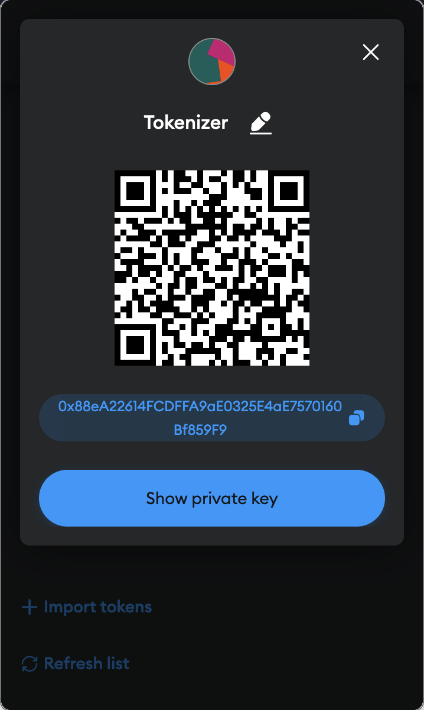
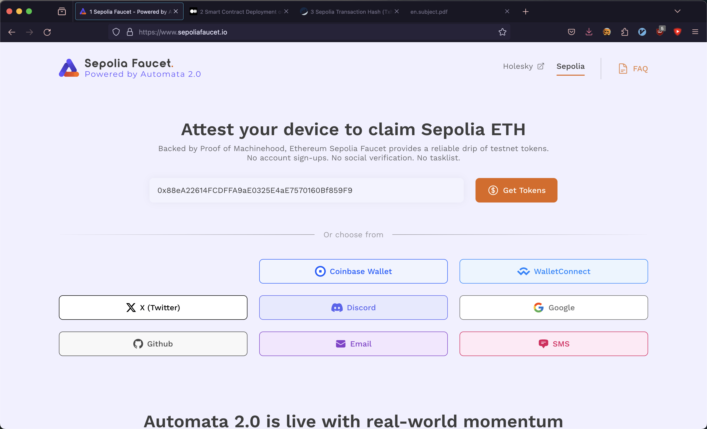
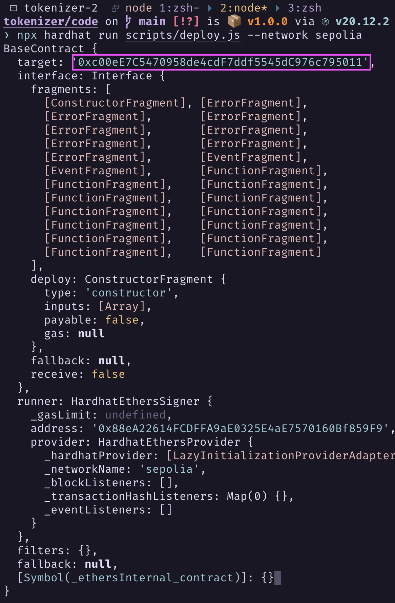
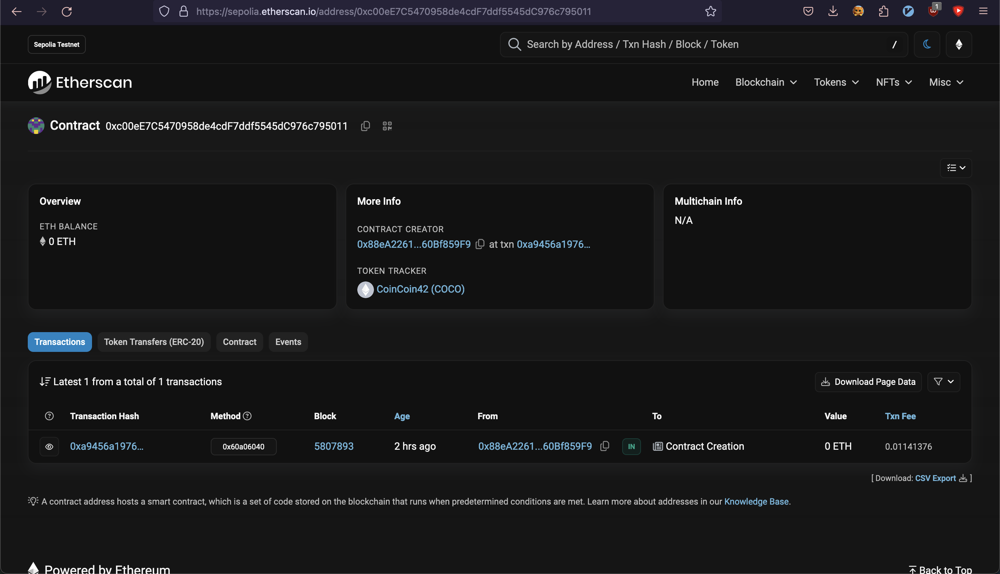
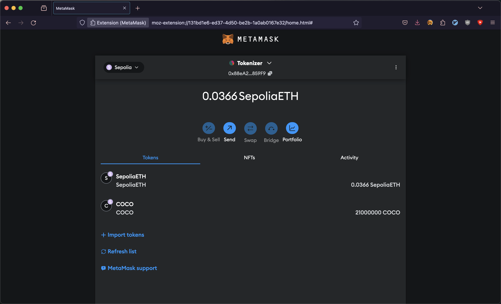

# Deployment of CoinCoin42

## Requirements:

- npm
- node lts

Then clone the project cd in ``tokenizer/code`` and type ``npm install``

## Deployment script

You can deploy the token with hardat, i config mine to deploy it on Sepolia testnet.

First you need to setup a .env file with 2 secrets in it:

```
PRIVATE_KEY="you metamask private key"
API_ENDPOINT=https://rpc2.sepolia.org
```

To find your PRIVATE_KEY follow these step:

go to your metamask extension in your favorite browser and go to your account details:



Then click on the Show your private key button enter your password and copy the key in your .env file:



To get the api endpoint all sepolia test net endpoint should work i choose to use: https://rpc2.sepolia.org
but you can try another one if you want. They are some example on: https://www.alchemy.com/overviews/sepolia-rpc-providers

Finally before deploying you need some Sepolia ETH for paying deployment fee on the Sepolia testnet. Lucky for us we
can get some for free on: https://www.sepoliafaucet.io/ just enter you metamask address and claim some coin !



When you env file is correctly configured and you got some Sepolia ETH you just have to run the command: ``npx hardat run script/deploy.js --network sepolia``
from code/ directory wait a little and done ! You token should be deployed on the Sepolia test net you can check it by copying
the contract address: 

And then copy it on https://sepolia.etherscan.io you should see the contract creation !



For finish we should get 21 millions token on the owner wallet lets check it !



We are rich now 😎🎊
