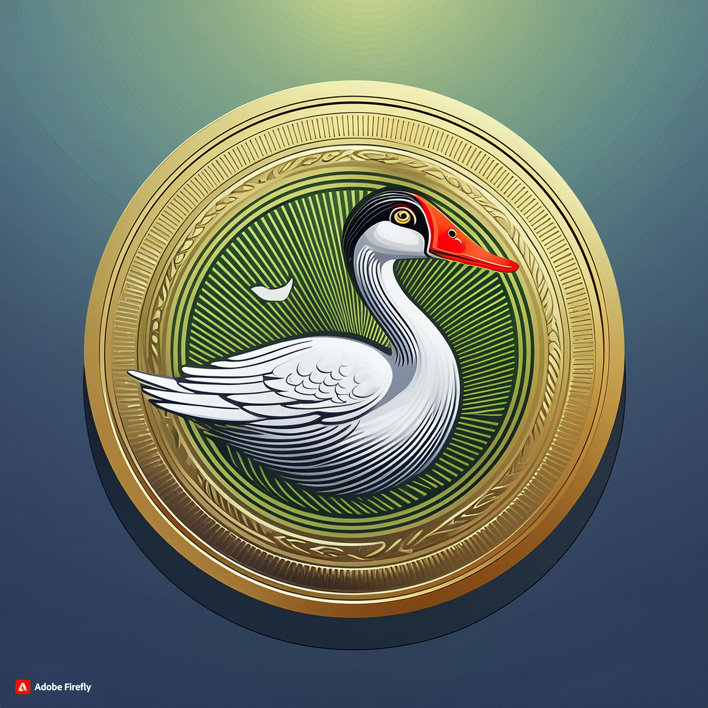

# CoinCoin42 Token Documentation

## Introduction

CoinCoin is a token created on the Ethereum blockchain, in the Sepolia Testnet network.

### Token Characteristics

- Token Name: CoinCoin42
- Token Symbol: COCO
- Total Supply: 42 million tokens
- Tokens Generated for the Creator: 21 million
- Token Type: ERC-20

Contract Address: ``0xc00eE7C5470958de4cdF7ddf5545dC976c795011``

## Intended Uses

Duck and forest Conservation

CoinCoin42 tokens can be used at all participating forests, parks, and similar locations. When you visit, the park might give you some tokens for free, or you can buy them. A portion of the revenue generated from CoinCoin42 token transactions will be donated to organizations that protect forests and ducks. You can use your CoinCoin42 tokens to buy merchandise or, for example, to book guided tours in wildlife sanctuaries with our partners. This approach allows token holders to make a positive environmental impact while enjoying their visits.

## Features

- Transfers: CoinCoin tokens can be transferred between compatible wallets.
- Capped: Coincoin is capped at 42,000,000 tokens
- Fungible: Coincoin Tokens are all the same
- Burnable: Owner can burn tokens

## Usage Instructions

To use CoinCoin tokens, follow these steps:

- Install a Compatible Wallet: Download and install a wallet compatible with the specified blockchain, such as metamask.
- Import the Token: Add the CoinCoin token to your wallet using the contract address provided above.
- Transfer Tokens: To send tokens to another user, use the transfer function in your wallet.
- Receive Tokens: To receive tokens, share your wallet address with the sender.

## Security and Precautions

- Protect Your Private Keys: Never share your private keys or recovery phrases.
- Check Addresses: Ensure you're using the correct addresses to avoid token loss.
- Scams and Fraud: Be cautious of scams or phishing attempts. Always verify the source of token requests.

## Contact Information

For questions or assistance, you can contact us at macrespo@student.42.fr
